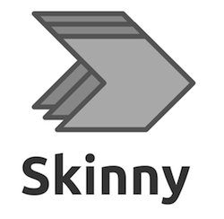

# Skinny Framework
<hr/>

Skinny is a full-stack web app framework, which is built on [Scalatra](http://scalatra.org) and additional components are integrated.

To put it simply, Skinny framework's concept is **Scala on Rails**. Skinny is highly inspired by [Ruby on Rails](http://rubyonrails.org/) and it is optimized for sustainable productivity for ordinary Servlet-based app development.

<hr/>
### Why Skinny?
<hr/>

What does the name of `Skinny` actually mean? We have three reasons as follows.

#### Application should be skinny

All the parts of web application - controllers, models, views, routings and other settings - should be skinny. If you use Skinny framework, you don't need to have non-essential code anymore. For instance, when you create a simple registration form, all you need to do is just defining parameters and validation rules and creating view templates in an efficient way (ssp, scaml, jade, FreeMarker or something else) in most cases.

#### Framework should be skinny

Even if you need to investigate Skinny's inside, don't worry. Skinny keeps itself skinny, too. I believe that if the framework is well-designed, eventually the implementation is skinny. 

#### "su-ki-ni" in Japanese means "as you like it"

A sound-alike word **"好きに (su-ki-ni)"** in Japanese means **"as you like it"**. This is only half kidding but it also represents Skinny's concept. Skinny framework should provide flexible APIs to empower developers as much as possible and shouldn't bother them.

<hr/>
## Try Skinny Framework now!
<hr/>

Download `skinny-blank-app.zip` and unzip it, then just run ./skinny command on your terminal. That's all!

If you're a Windows user, don't worry. Use skinny.bat on cmd.exe instead.

[](https://github.com/skinny-framework/skinny-framework/releases/download/0.9.26/skinny-blank-app.zip)

Let's create your first Skinny app by using scaffold generator.

```sh
./skinny g scaffold members member name:String activated:Boolean luckyNumber:Option[Long] birthday:Option[LocalDate]
./skinny db:migrate
./skinny run
```

And then, access `http://localhost:8080/members`.

You can run generated tests.

```
./skinny db:migrate test
./skinny test
```

Let's create war file to deploy.

```sh
./skinny package
```

or it's possible to portable runnable jar file (with embedded Jetty server).

```sh
./skinny package:standalone
```

<hr/>
### Try by using Yeoman generator
<hr/>


If you're familiar with [Yeoman](http://yeoman.io), a generator for [Skinny framework](https://github.com/skinny-framework/skinny-framework) is available.

[](https://npmjs.org/package/generator-skinny)

```sh
# brew install node
npm install -g yo
npm install -g generator-skinny
mkdir skinny-app
cd skinny-app
yo skinny
./skinny run
```

<hr/>
### Integrating with existing Scalatra apps
<hr/>

Actually, application built with Skinny framework is a Scalatra application.

After preparing Scalatra app, just add the following dependency to your `project/Build.scala`.

```
libraryDependencies ++= Seq(
  "org.skinny-framework" %% "skinny-assets"    % "[0.9,)",
  "org.skinny-framework" %% "skinny-framework" % "[0.9,)",
  "org.skinny-framework" %% "skinny-task"      % "[0.9,)",
  "org.skinny-framework" %% "skinny-test"      % "[0.9,)" % "test"
)
```

If you need only Skinny-ORM or Skinny-Validator, you can use only what you need. Even if you're a Play2 (or any others) user, these components are available for you as well.

```
libraryDependencies ++= Seq(
  "org.skinny-framework" %% "skinny-orm"        % "[0.9,)",
  "org.skinny-framework" %% "skinny-mailer"     % "[0.9,)",
  "org.skinny-framework" %% "skinny-standalone" % "[0.9,)",
  "org.skinny-framework" %% "skinny-validator"  % "[0.9,)"
)
```

<hr/>
## Skinny's Components Overview
<hr/>

### Routing & Controller & Validator
<hr/>

Skinny's routing mechanism and controller layer on MVC architecture is a **rich Scalatra**. Skinny's extension provides you much simpler/rich syntax. Of course, if you need to use Scalatra's API directly, Skinny never bothers you.


`SkinnyController` is a trait which extends `ScalatraFilter` and out-of-the-box components are integrated. 

```java
// src/main/scala/controller/MembersController.scala
class MembersController extends SkinnyController {
  def index = {
    set("members" -> Member.findAll()) // can call this in views
    render("/members/index")
  }
}
// src/main/scala/controller/Controllers.scala
object Controllers {
  object members extends MembersController with Routes {
    val indexUrl = get("/members/?")(index).as('index)
  }
}
// src/main/scala/ScalatraBootstrap.scala
class ScalatraBootstrap exntends SkinnyLifeCycle {
  override def initSkinnyApp(ctx: ServletContext) {
    Controllers.members.mount(ctx)
  }
}
```

`SkinnyResource` which is similar to Rails ActiveResource is available. That's a pretty DRY way.

```java
object CompaniesController extends SkinnyResource {
  protectFromForgery()

  override def model = Company
  override def resourcesName = "companies"
  override def resourceName = "company"

  ...
}
```

`Company` object should implement `skinny.SkinnyModel` APIs and you should prepare some view templates under `src/main/webapp/WEB-INF/views/members/`.

See in detail: [Controller & Routes](documentation/controller-and-routes.html)

<hr/>
### Skinny ORM
<hr/>

Skinny provides you Skinny-ORM as the default O/R mapper, which is built with [ScalikeJDBC](https://github.com/scalikejdbc/scalikejdbc).


Skinny-ORM is much powerful, so you don't need to write much code. Your first model class and companion are here.

```java
case class Member(id: Long, name: String, createdAt: DateTime)

object Member extends SkinnyCRUDMapper[Member] {
  override def defaultAlias = createAlias("m")
  override def extract(rs: WrappedResultSet, n: ResultName[Member]) = new Member(
    id = rs.long(n.id),
    name = rs.string(n.name),
    createdAt = rs.dateTime(n.createdAt)
  )
}
```

That's all! Now you can use the following APIs.

```java
// find by primary key
val member: Option[Member] = Member.findById(123)
val member: Option[Member] = Member.where('id -> 123).apply().headOption
val members: List[Member] = Member.where('id -> Seq(123, 234, 345)).apply()

// find many
val members: List[Member] = Member.findAll()
val groupMembers = Member.where('groupName -> "Scala Users", 'deleted -> false).apply()

// create with unsafe parameters
Member.createWithAttributes(
  'id -> 123,
  'name -> "Chris",
  'createdAt -> DateTime.now
)
// update with unsafe parameters
Member.updateById(123).withAttributes('name -> "Alice")
// delete
Member.deleteById(234)
```

See in detail: [O/R Mapper](documentation/orm.html)


<hr/>
### DB Migration with Flyway
<hr/>

DB migration comes with [Flyway](http://flywaydb.org/). Usage is pretty simple.


```sh
./skinny db:migrate [env]
````

This command expects `src/main/resources/db/migration/V***__***.sql` files. 

See in detail: [DB Migration](documentation/db-migration.html)


<hr/>
### View Templates
<hr/>

Skinny framework basically follows Scalatra's [Scalate](http://scalate.fusesource.org/) Support, but Skinny has an additional convention.


Templates' path should be `{path}.{format}.{extension}`. Expected {format} are `html`, `json`, `js` and `xml`.

For instance, your controller code will be like this:

```java
class MembersController extends SkinnyController {
  def index = {
    set("members", Member.findAll())
    render("/members/index")
  }
}
```

The render method expects that `src/main/webapp/WEB-INF/views/members/index.html.ssp` exists.

```
<%@val members: Seq[model.Member] %>
<hr/>
#for (member <- members)
  ${member.name}
#end
```

Scalate supports many template engines. If you'd like to use other Scalate templates, just override the settings in controllers.

```java
class MembersController extends SkinnyController {
  override val scalateExtension = "jade"
}
```

And then, use `src/main/webapp/WEB-INF/views/members/index.html.jade` instead.

See in detail: [View Templates](documentation/view-templates.html)

<hr/>
### Assets Support (CoffeeScript, LESS, Sass and JXS for React)
<hr/>


First, add `skinny-assets` to libraryDependencies.

```
libraryDependencies ++= Seq(
  "org.skinny-framework" %% "skinny-framework" % "[0.9,)",
  "org.skinny-framework" %% "skinny-assets"    % "[0.9,)",
  "org.skinny-framework" %% "skinny-test"      % "[0.9,)" % "test"
)
```

And then, add `AssetsController` to routes. Now you can easily use CoffeeScript, LESS and Sass.

```java
// src/main/scala/ScalatraBootstrap.scala
class ScalatraBootstrap exntends SkinnyLifeCycle {
  override def initSkinnyApp(ctx: ServletContext) {
    AssetsController.mount(ctx)
  }
}
```

AssetsController supports Last-Modified header and returns status 304 correctly if the requested file isn't changed. 

However, precompiling them is highly recommended in production (./skinny package does that).

See in detail: [Assets Support](documentation/assets.html)

<hr/>
### Testing Support
<hr/>

You can use Scalatra's great test support. Some optional feature is provided by skinny-test library.

```java
class ControllerSpec extends ScalatraFlatSpec with SkinnyTestSupport {
  addFilter(MembersController, "/*")

  it should "show index page" in {
    withSession("userId" -> "Alice") {
    i  get("/members") { status should equal(200) }
    }
  }
}
```

See in detail: [Testing](documentation/testing.html)

<hr/>
### FactoryGirl
<hr/>

Though Skinny's FactoryGirl is not a complete port of [thoughtbot/factory_girl](https://github.com/thoughtbot/factory_girl), this module will be quite useful when testing your apps.

```java
case class Company(id: Long, name: String)
object Company extends SkinnyCRUDMapper[Company] {
  def extract ...
}

val company1 = FactoryGirl(Company).create()
```

Settings is not in yaml files but typesafe-config conf file. In this example, `src/test/resources/factories.conf` is like this:

```
company {
  name="FactoryGirl, Inc."
}
```

See in detail: [FactoryGirl](documentation/factory-girl.html)

<hr/>
### Under The MIT License
<hr/>

(The MIT License)

Copyright (c) 2013 skinny-framework.org


